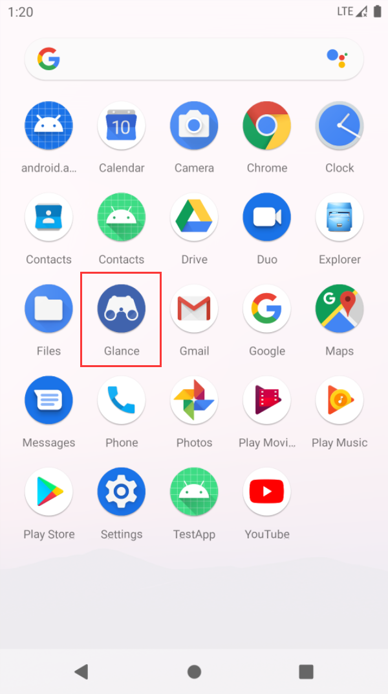
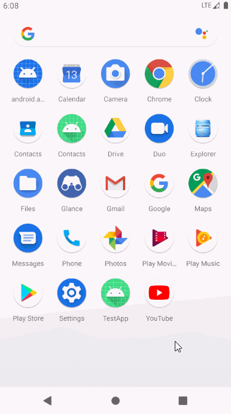

# Glance

Glance is an open source Android database toolkit library which can help you browser all the database data with clean UI interface.

Glance is inspired by LeakCanary to be included into your project as dependency library. It will search both internal and external storage of current app to find out all the database files automatically.

Glance provides a clean UI interface to display all the data in the database, and make the database debugging work very easy.

You can experience it right now with below dependency.

```groovy
dependencies {
    // debugImplementation because Glance should only run in debug builds.
    debugImplementation 'com.glance.guolindev:glance:1.0.0-alpha01'
}
```

After adding the dependency to your project, you will see A new Glance icon on your launcher.



Click it to browse all the database data of your app. It's quite easy.

The below animation shows how it works.



Note that Glance only supports AndroidX projects. Android-Support projects can't use this library and no plan to support for them in the future release either.